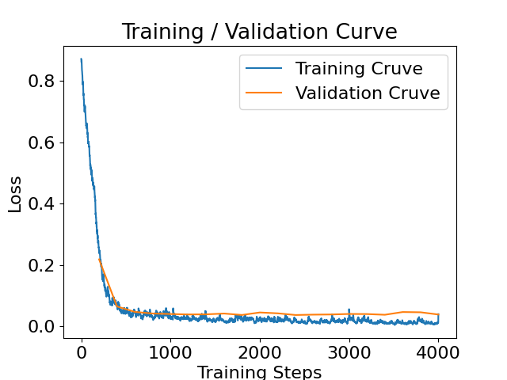
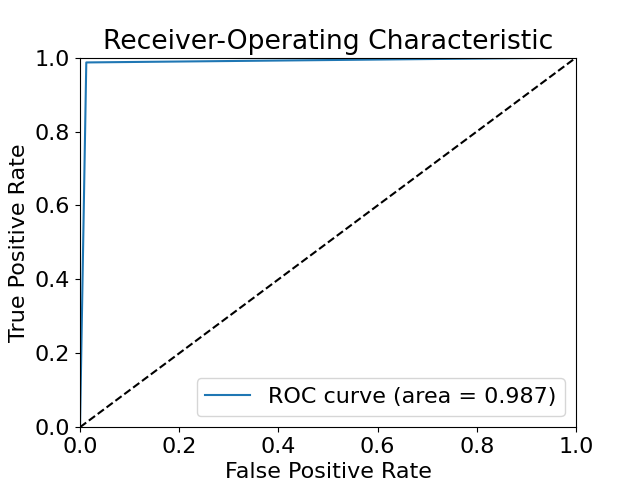
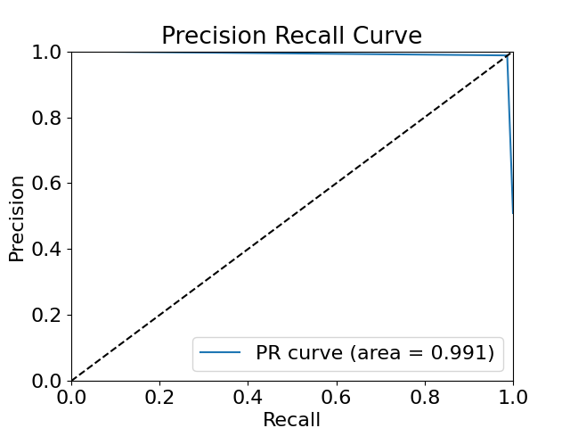
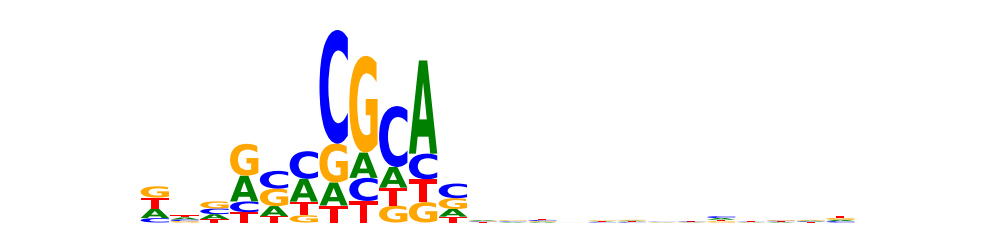

# Transcription Factor Binding

## Overview 
Given a list of DNA sequences bound to an unknown **Transcription Factor (TF)** from an HT-SELEX experiment, we would like to gain insight into the binding preferences of this Transcription Factor and build a predictor that helps us identify novel sequences that would bind to it. In order to achieve this, we train a deep neural network that can distinguish between *bound* and *control* sequences. The set of artificially generated sequences (positive examples) to be used for training are provided in the `train.csv` file.

## Dataset Preparation
To prepare the dataset for training, first we need to generate negative examples. 

### Generating negative examples
- A simple random generation of DNA sequences would not be helpful since it is easy for a model to perform well on such sequences by relying on low-level statistics of genomic regions such as promoters or coding regions.
- So in order to generate negative examples, we turn to *dinucleotide-preserving shuffles* based on the positive examples. A dinucleotide-preserving shuffling preserves the count of all 16 dinuc's, i.e. [AA, AC, ..., GT, TT].
- We make use of [Alipanahi et. al. [2014]](https://www.nature.com/articles/nbt.3300)'s code which is based on Altschul and Erickson's Algorithm for shuffling a sequence while preserving the doublet frequency.
- We produce 7500 negative sequences, to balance the dataset.

### Padding the sequences
- Since the sequences vary in size we pad them with a null character 'N' up to the maximum length of the sequences (i.e. 64).
- 15% of the overall generated training data is used as a validation set and for monitoring the performance of the model.

## Model Design
- Our architecture is similar to [Wang et. al [2018]](https://academic.oup.com/nar/article/46/11/e69/4958204). 

### Architecture
- We use a convolutional layer followed by ReLU activation, max-pooling and average-pooling, batch-normalization, and two fully connected layers.
- There are 16 convolutional filters with length 24.
- We use dropout between the final fully connected layers
- The output uses Sigmoid activation and predicates the binding intensity of the sequences.

### Reverse-complement strand
- We make use of the reverse complement strand of each sequence as well. The reverse complement strand uses the same convolutional filters as the original strand.
- It is important to use the reverse complement strand since it is unknown that the transcription factor is bound to the original strand or the reverse complement strand.
- The two pipelines from the original strand and the reverse complement strand are concatenated together at the batch-normalization stage.

### Loss function
- We use the Binary Cross-Entropy loss function, since the goal of the model is to distinguish between bound and unbound sequences.

### Optimizer
- We use the Adam optimizer.

## Hyperparameters
- The hyperparameters can be selected using Grid Search or Random Search. However *due to a time limit* we chose hyperparameters mostly based on experience and resources with similar experiments.
- *Learning rate* and *weight decay* were set to 0.001. *Batch size* was set to 64, and the *dropout* rate was set to 0.5. The number of *filters* for the convolutional layer was set to 16, and the *filter size* was set to (4, 24). The *size of fully connected layers* were set to 128. 

## Initialization
- The model weights were initialized using *Xavier* initialization.

## Files and Folders
- `tf_prediction.py`: Main script for training and evaluating the model on the training / validation and test sets. Saves the trained model, metrics, and sequence logo in the `results_training` folder. If the argument `--test` is passed, the results are stored in the `results_test` folder.
- `utils.py`: Script implementing necessary utility functions such as the dataset class, neural network architecture, motif logo generation and metric plots.
- `prepare_data.py`: Script preparing the dataset for training by generating negative sequences and padding. 
- `doublet_shuffle.py`: Script implementing the nucleotide-preserving shuffles from the original sequences. (borrowed from [Alipanahi et. al. [2014]](https://www.nature.com/articles/nbt.3300))
- `environment.yml`: The Ananconda environment file for ease of reproducibility.
- `data` folder: Folder containing the data, includes `train.csv`, `train_processed.csv`

## Reproduce
- In order to reproduce the model, first, clone the Conda environment using the environment file:
```bash
conda env create -f environment.yml 
```
- Then run the `prepare_data.py` script to prepare the dataset for training.
```bash
python prepare_data.py 
```
- Then run the `tf_prediciton.py` script:
```bash
python tf_prediciton.py 
```
- If testing is desired (after training the model) put the test dataset as `test.csv` in the `data` folder (the test set file should have rows as such: [sequence,label]) and then run:
```bash
python tf_prediciton.py --test
``` 

## Results
- The model was trained for *20 epochs* on both bound and unbound (generated using doublet shuffling) sequences. 15% of the dataset was used as validation set for hyperparameter tuning.
- The training and validation losses during training are shown below, showing the model’s improvement through training on the training and validation set.
<p align="center">
    
</p>

- The following figures show the **ROC** and **Precision-Recall** curve of the model on the validation set. The ROC curve has an Aread Under Curve (AUC) of ***0.987*** indicating an almost perfect classification of the bound and unbound sequences. Similarly the Precision-Recall curve has an AUC of ***0.991***.
<p align="center">
    
    
</p>

- Below is the *sequence logo* generated from the motifs extracted by the convolutional layer of the model. The sequence logo highlights the potential binding site of the unknown transcription factor.
<p align="center">
    
</p>

- The height of each position in the sequence logo corresponds to the *information content* of that position (in bits) while the height of each letter is proportional to the *probability* of that letter in its position.
- The sequence logo is derived from the motif detector (convolutional layer)’s response to the actual sequences in the validation set. By scanning through all the filters, for both forward and reverse-complement of a sequence we find the position with the maximum response. After that, we extract a subsequence from the original sequence starting from that position with a length equal to the motif detector. By repeating this for all the sequences and aligning them, we calculate the **position frequency matrix (PFM)**. The PFM is then used to create the sequence logo.
- The proposed model is robust when repeated experiments with different intialization and hyperparameters lead to the same generated sequence logo. This indicates that the model is able to detect the transcription factor motif and its binding site with confidence.